# Hook → Agent → Skill: How the Pipeline Connects

> **Labs covered:** Lab 2 (Steering Files), Lab 4 (Security & Tests), Lab 5 (Custom Agents), Lab 6 (Hook Pipeline)

---



*Figure: A developer IDE event fires a Hook, which delegates to an Agent, which executes a Skill — all grounded in shared Steering context.*

---

## Overview

**Hook → Agent → Skill is a chain of delegation.** Each layer has exactly one job. Understanding the separation makes it easy to change any part of the pipeline without touching the others.

---

## The Three Layers

### Layer 1 — Hook (`.kiro/hooks/`)

A Hook is a pure event listener. It watches for something to happen in the IDE and when it fires, it does one thing: hand control to a named agent.

The hook itself contains no intelligence, no prompts, and no rules. It is a routing table — nothing more.

**Triggers used in Lab 6:**

| Hook | Trigger | Calls Agent |
|---|---|---|
| `javadoc-on-save` | `onFileSave` | `docs-agent` |
| `security-lint-on-commit` | `onCommit` | `security-review-agent` |
| `test-on-new-class` | `onFileCreate` | `test-generator-agent` |

**Example hook definition (`.kiro/hooks/javadoc-on-save.yaml`):**

```yaml
name: javadoc-on-save
trigger: onFileSave
filePattern: "**/*.java"
agent: docs-agent
```

---

### Layer 2 — Agent (`.kiro/agents/`)

An Agent is an orchestrator. It receives the event from the hook, reads the files that changed, decides what to do, and calls the skills it was configured with.

The agent holds the **goal** ("generate Javadoc for this class") but not the **standards** ("Javadoc must include `@param`, `@return`, `@throws`, and a one-sentence summary"). Those live in the Skill.

**Agents built in Lab 5:**

| Agent | Purpose | Skills Referenced |
|---|---|---|
| `docs-agent` | Reads class, writes Javadoc | `javadoc-skill` |
| `security-review-agent` | Scans for vulnerabilities | `owasp-skill` |
| `test-generator-agent` | Generates JUnit 5 tests | `junit5-skill` |

**Example agent definition (`.kiro/agents/docs-agent.yaml`):**

```yaml
name: docs-agent
description: Generates Javadoc for Java classes
skills:
  - javadoc-skill
prompt: |
  Read the changed Java file. Generate or update Javadoc
  for all public methods following the javadoc-skill rules.
```

---

### Layer 3 — Skill (`.kiro/skills/` or `.amazonq/rules/`)

A Skill is persistent, reusable knowledge. It is a Markdown or YAML file that encodes a standard — the OWASP Top 10 checklist, your JUnit 5 test patterns, your Javadoc format rules.

Any agent that references a skill inherits that knowledge. You write the standard once and every agent that runs in your pipeline honours it automatically.

> **Important:** In Kiro IDE, skills live in `.kiro/skills/`. In Amazon Q Developer, the equivalent persistent rules live in `.amazonq/rules/`. Do not confuse the two directories.

**Skills used across the labs:**

| Skill | Content | Used By |
|---|---|---|
| `javadoc-skill` | Javadoc format rules (`@param`, `@return`, `@throws`, summary sentence) | `docs-agent` |
| `owasp-skill` | OWASP Top 10 checklist, remediation guidance | `security-review-agent` |
| `junit5-skill` | JUnit 5 test patterns, Mockito usage, coverage targets | `test-generator-agent` |

**Example skill file (`.kiro/skills/javadoc-skill.md`):**

```markdown
# Javadoc Skill

All public methods must have Javadoc with:
- A one-sentence summary on the first line
- @param for every parameter, with type and purpose
- @return describing the return value and type
- @throws for every checked exception

Never generate Javadoc for private or package-private methods.
```

---

## The Foundation — Steering Context

Underneath all three layers, the **Steering files** from Lab 2 provide always-on context. They are not invoked by hooks — they are automatically included in every agent session.

**Steering files (`.amazonq/rules/` for Q Developer, `.kiro/steering/` for Kiro):**

| File | What it gives every agent |
|---|---|
| `architecture.md` | Package structure, module boundaries, service names |
| `testing-standards.md` | Test framework choices, coverage targets, naming conventions |
| `api-conventions.md` | REST naming rules, error response format, versioning strategy |

This means the generated Javadoc knows your package structure, the security scan knows your tech stack, and the test generator knows you use Testcontainers for integration tests — without any agent needing to be told explicitly.

---

## How It All Fits Together

A single `git commit` can trigger three agents in parallel:

```
git commit
    │
    ├── onCommit ──► security-lint-on-commit hook
    │                    │
    │                    └──► security-review-agent
    │                              │
    │                              └──► owasp-skill + steering context
    │                                        │
    │                                        └──► Security report
    │
    └── [file changes detected]
         │
         ├── onFileSave ──► javadoc-on-save hook
         │                       └──► docs-agent ──► javadoc-skill ──► Javadoc
         │
         └── onFileCreate ──► test-on-new-class hook
                                  └──► test-generator-agent ──► junit5-skill ──► JUnit suite
```

Each agent is governed by its own skill, and all are grounded in the same steering context. The governance is baked into the pipeline — not applied after the fact.

---

## Key Design Principle

| Layer | Owns | Does NOT own |
|---|---|---|
| Hook | When to trigger, which agent to call | What the agent does |
| Agent | Goal, workflow, which skills to apply | The standards inside each skill |
| Skill | The standard (format rules, checklists, patterns) | When it runs or which files it reads |
| Steering | Always-on architectural context | Any specific task logic |

Keeping these concerns separate means you can change a coding standard (update the skill) without touching any hook or agent. You can add a new pipeline stage (add a hook + agent) without modifying existing skills. The system composes cleanly.

---

## Lab Reference

| Concept | Introduced in | Directory |
|---|---|---|
| Steering files | Lab 2 | `.amazonq/rules/` (Q Dev) / `.kiro/steering/` (Kiro) |
| Security scan agent | Lab 4 | `.kiro/agents/` |
| Test generator agent | Lab 4 | `.kiro/agents/` |
| Custom agents + skills | Lab 5 | `.kiro/agents/`, `.kiro/skills/` |
| Hook pipeline | Lab 6 | `.kiro/hooks/` |
| All layers active together | Capstone 1 & 2 | — |