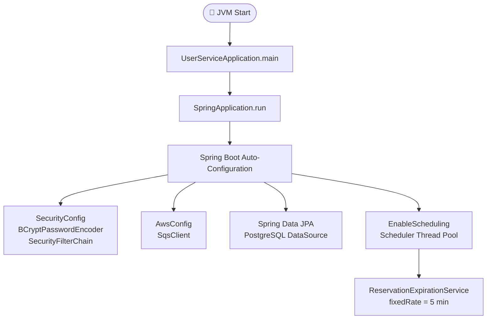
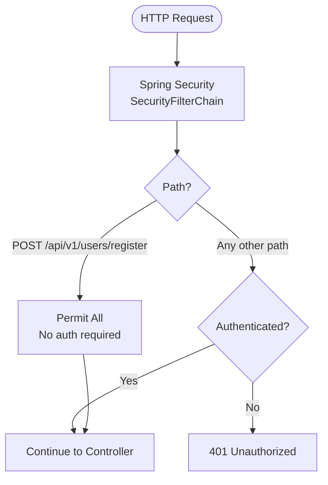
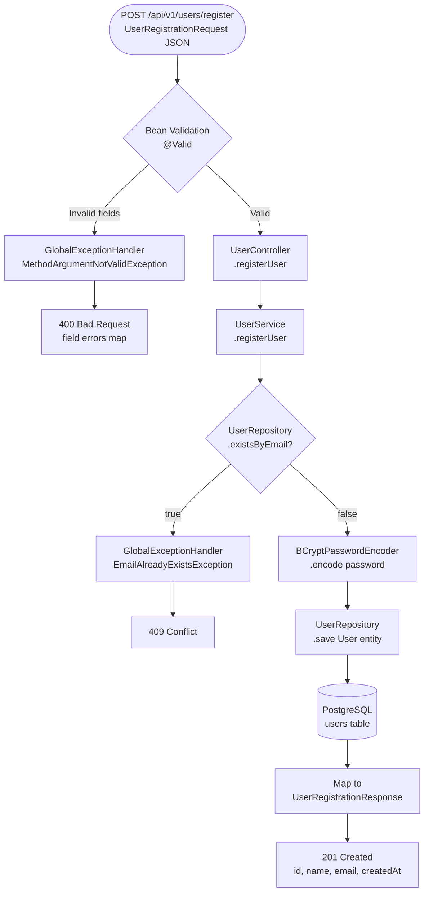
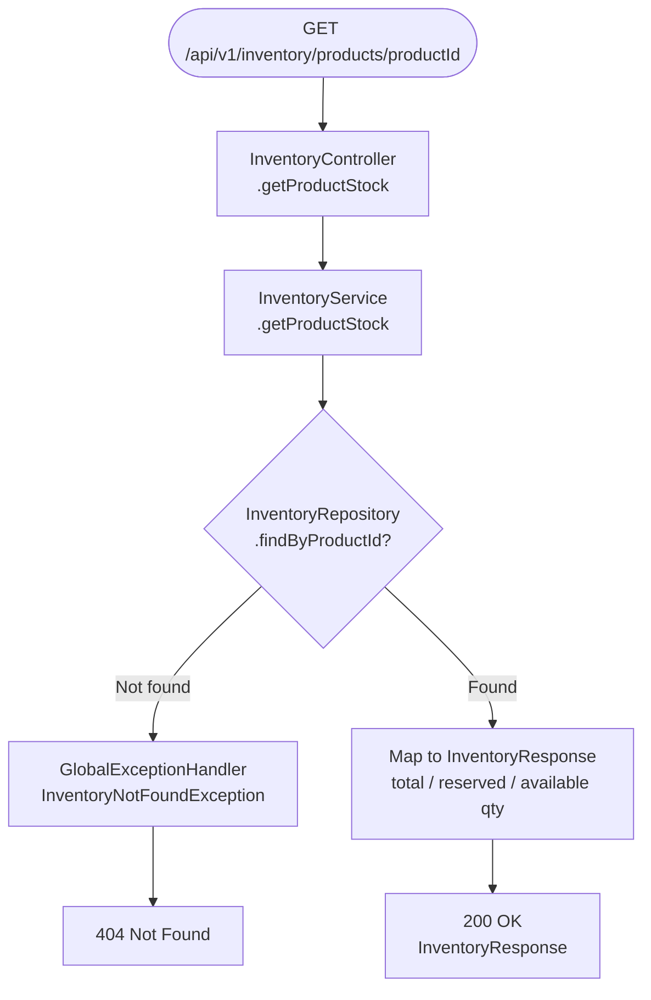
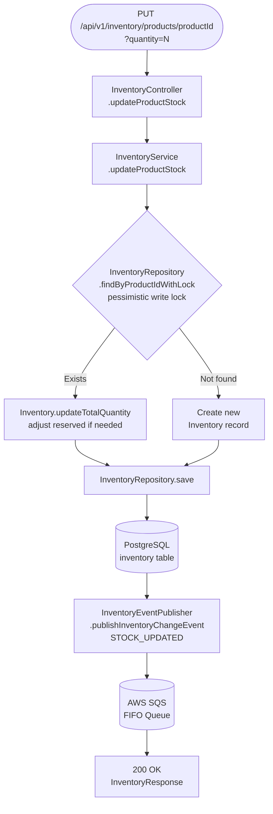
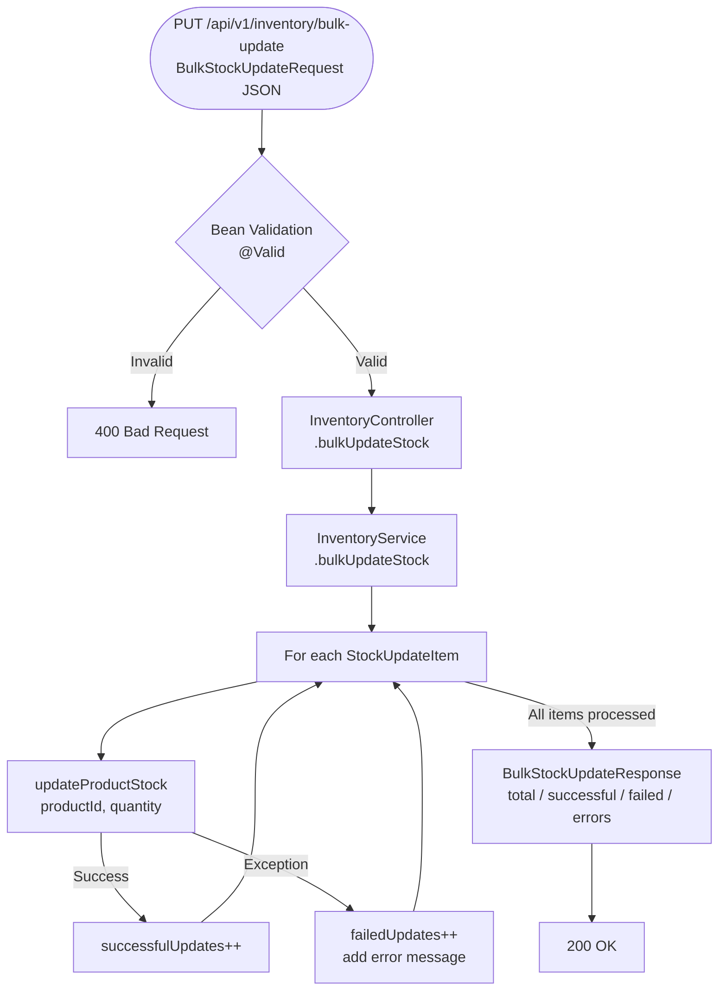
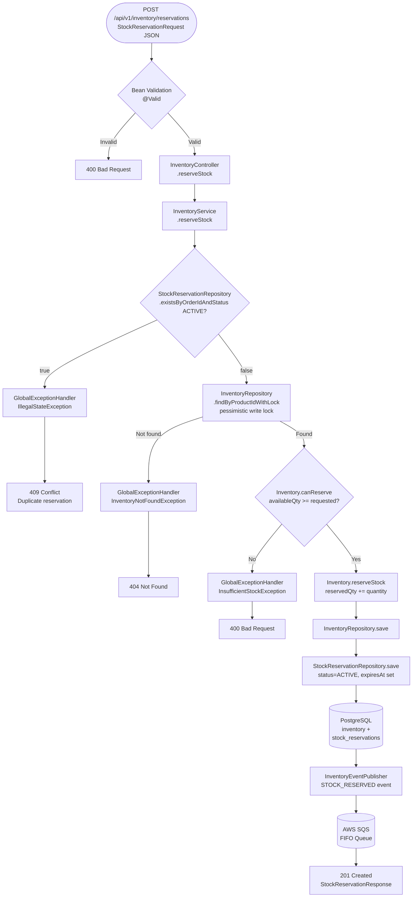
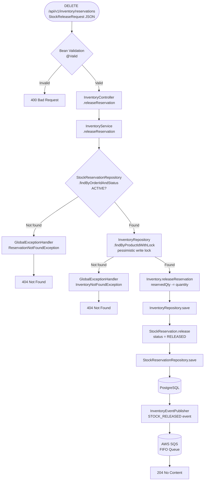
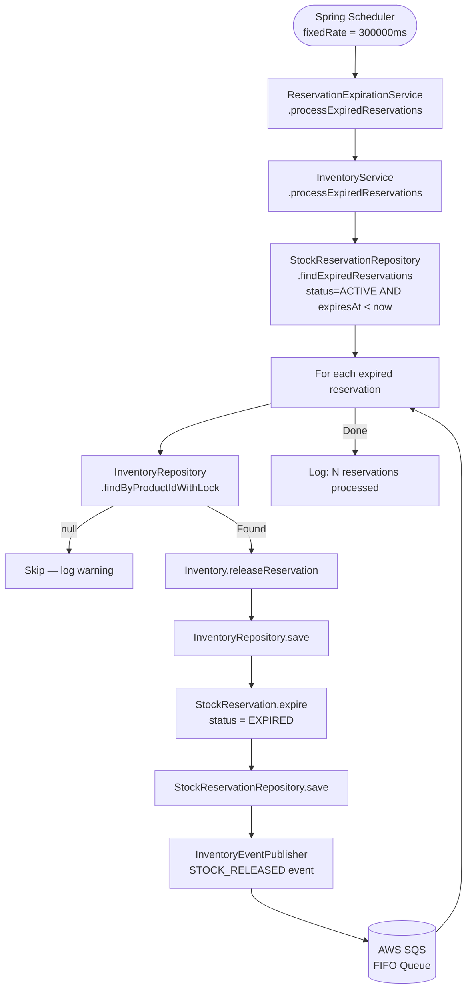

Prompt: I want to generate a mermaid diagram based flowchart of my whole project from entry point to all API's, so that any new developer onboarded can understand my flow


# Project Architecture Flowchart

> A visual guide to the full request flow — from application startup to every API endpoint.
> Intended for new developers onboarding to this service.

---

## Application Entry Point & Startup



---

## Security Filter — Every Inbound Request



---

## User API — POST /api/v1/users/register



---

## Inventory API — GET /api/v1/inventory/products/{productId}



---

## Inventory API — PUT /api/v1/inventory/products/{productId}



---

## Inventory API — PUT /api/v1/inventory/bulk-update



---

## Inventory API — POST /api/v1/inventory/reservations



---

## Inventory API — DELETE /api/v1/inventory/reservations



---

## Scheduled Job — Reservation Expiration (every 5 min)



---

## Error Handling — GlobalExceptionHandler

```mermaid
flowchart LR
    EX1[EmailAlreadyExistsException] --> GEH[GlobalExceptionHandler\n@RestControllerAdvice]
    EX2[InsufficientStockException] --> GEH
    EX3[InventoryNotFoundException] --> GEH
    EX4[ReservationNotFoundException] --> GEH
    EX5[MethodArgumentNotValidException] --> GEH
    EX6[Exception catch-all] --> GEH

    GEH --> R409[409 Conflict]
    GEH --> R400[400 Bad Request]
    GEH --> R404[404 Not Found]
    GEH --> R500[500 Internal Server Error]
```

---

## Full Component Map

```mermaid
flowchart TD
    subgraph Entry
        MAIN[UserServiceApplication\n@SpringBootApplication\n@EnableScheduling]
    end

    subgraph Config
        SEC[SecurityConfig]
        AWS[AwsConfig → SqsClient]
    end

    subgraph Controllers
        UC[UserController\nPOST /api/v1/users/register]
        IC[InventoryController\nGET/PUT/POST/DELETE\n/api/v1/inventory/...]
    end

    subgraph Services
        US[UserService]
        IS[InventoryService]
        IEP[InventoryEventPublisher]
        RES[ReservationExpirationService\nScheduled]
        PS[PricingService\ncalculateDiscount\ncalculateTax]
    end

    subgraph Repositories
        UR[UserRepository]
        IR[InventoryRepository]
        SRR[StockReservationRepository]
    end

    subgraph Entities
        UE[User]
        IE[Inventory]
        SRE[StockReservation]
    end

    subgraph External
        PG[(PostgreSQL)]
        SQS[(AWS SQS FIFO)]
    end

    subgraph ExceptionHandling
        GEH[GlobalExceptionHandler\n@RestControllerAdvice]
    end

    MAIN --> Config
    MAIN --> Controllers
    MAIN --> RES

    UC --> US
    IC --> IS

    US --> UR
    IS --> IR
    IS --> SRR
    IS --> IEP
    RES --> IS

    IEP --> SQS

    UR --> PG
    IR --> PG
    SRR --> PG

    UR -.->|maps to| UE
    IR -.->|maps to| IE
    SRR -.->|maps to| SRE

    Controllers -.->|throws| GEH
    Services -.->|throws| GEH
```
